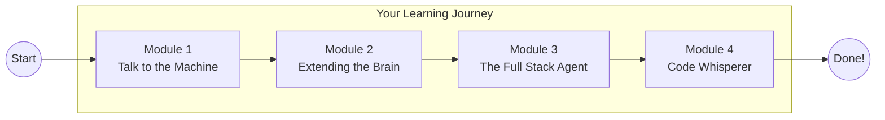

# Fifth Elephant Workshop


> Build production-ready AI agents from zero to deployment

---

## Workshop Flow



---

## Getting Started

```bash
# Clone this repo
git clone <repo-url>
cd fifth_elephant_workshop

# Start with Module 1
git checkout module-1
```

---

## Workshop Modules

| Module | Branch | Title | What You'll Build |
|:------:|--------|-------|-------------------|
| 01 | [`module-1`](../../tree/module-1) | **Talk to the Machine** | Your first LLM-powered chat application |
| 02 | [`module-2`](../../tree/module-2) | **Extending the Brain** | Build and deploy your own MCP Server |
| 03 | [`module-3`](../../tree/module-3) | **The Full Stack Agent** | Inference + MCP integrated chat app |
| 04 | [`module-4`](../../tree/module-4) | **Code Whisperer** | An autonomous code review agent |

---

## Progress Tracker

- [ ] Module 01: Talk to the Machine
- [ ] Module 02: Extending the Brain
- [ ] Module 03: The Full Stack Agent
- [ ] Module 04: Code Whisperer

---

## Navigating Between Modules

```bash
git checkout module-1   # Talk to the Machine
git checkout module-2   # Extending the Brain
git checkout module-3   # The Full Stack Agent
git checkout module-4   # Code Whisperer
```

Each module branch contains:
- `README.md` with step-by-step instructions
- Starter code and exercises
- Solutions (where applicable)

---

## Prerequisites

Before starting, ensure you have:

- [ ] Python 3.10+ installed
- [ ] Basic understanding of Python
- [ ] API keys (will be provided during workshop)
- [ ] Code editor (VS Code recommended)

---

## Need Help?

Raise your hand during the workshop, or open an issue in this repo.

---

**Happy Building!**
